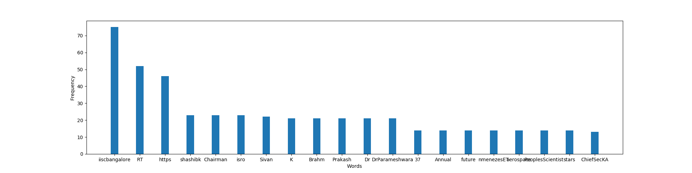
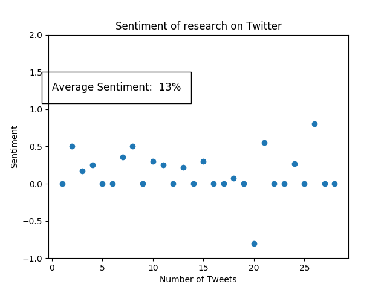

## Introduction
For the following questions, tweets were collected using Twitter's REST API, via its python wrappers Tweepy and Twython. All data that has been used for the analysis can be found in the `/data` directory. All code is in `/src`, and its outputs in the `/outputs` directory. The python modules used for the assignment are listed down in the `requirements.txt` file. Please look into the `README.md` file for instructions on how to run the codes along with external sources used in this project.

## Data collection
1. There are three Python scripts in the `/src` directory with the prefix 'get'. All these scripts were used to crawl and parse through Twitter data. Firstly, the `getSearchData.py` file uses Twython to search for the tags `@iiit_hyderabad` and `@iiscbangalore`. Since Twitter only allows tweets of the last 7 days up to a maximum of 100, only 64 tweets were collected for `@iiit_hyderabad` and 100 tweets for `@iiscbangalore`. These tweets were stored in `iiit_data.json` and `iisc_data.json` respectively.
2. The `getAllTweets.py` script gets all tweets of a user (up to 3200). The script uses Tweepy to request 200 tweets at a time to gather a total of up to 3200 tweets. This limit is enough for `@iiscbangalore` since that handle has tweeted less than 3200 times. However, since `@iiit_hyderabad` has tweeted more than that, not all tweets of that handle were collected. After collecting the tweets, they're stored in csv files `iiit_hyderabad_tweets.csv` and `iiscbangalore_tweets.csv` respectively.
3. The `getResearchData.py` script uses the above mentioned csv files to find all the tweets that have the word 'research' in them. This dataset is used in the `e.py` script for sentiment analysis. The tweets parsed through are stored in `research_iiit_hyderabad_tweets.csv` and `research_iiscbangalore_tweets.csv` respectively.

## Question a
For this question, the `iisc_data.json` and `iiit_data.json` files are used. After loading the json files, all the tweets are concatenated into one string, and then the stop words are removed from the entire concatenated string. Then, using the Counter library the 20 most common words along with their frequency is plotted on a graph. The outputs of the script are attached below:-\

From the histogram above, it is clear that most of the tweets consist of "RT" and "iiscbangalore" indicating that most of the tweets in the search result are retweets of IISC Bangalore's tweets. The words "Dr", "K", "Sivan", "ISRO", and "Chairman" appear a lot since Dr K Sivan, the Chairman of IISc Bangalore recently delivered a speech at ISRO.\

From the histogram above, yet again a lot of the tweets include "RT" implying that a lot of people are retweeting tweets by the IIIT Hyderabad account, or those that mention the handle. "set", "IntelIndia", "conditions", "MoveHack2018", and "data" are all popular due to a tweet sent out by `@IntelIndia` which announced an association with IIIT-H with #MoveHack2018 where world's first public data set of Indian driving conditions is being used.
\
\
\
\
\
\
\
\
\
\
\
\
\
\
\
\
\
\
\
\
\
\

## Question b
The same data set collected for the first question is used for this one as well. The tweets are concatenated once again, and using the WordCloud library, the stop words are removed from the concatenated string, and the Word Cloud is then generated for both data sets. \ Output for IIIT-H:- \
{#id .class width=100% text-align=center} \
Output for IISc:- \
{#id .class width=100%}\
The observations are similar to that of the first question.
\
\
\
\
\
\
\
\
\
\
\
\

## Question c
The same json data collected for the first two questions is used in this question as well. The time for each tweet is extracted and the number of tweets per day is plotted on to a graph. Since data is only available for a week, the x axis shows dates from 2018-08-20 to 2018-08-28. \
\
There seems to be a lot of interest about IIIT in the first few days. This is probably because of the tweet from `@IntelIndia` previously mentioned, which was tweeted on 2018-08-20. Interest maintains over the next couple of days and peaks on 2018-08-23, but dies down immediately by 2018-08-26. \
\
On 2018-08-21, ISRO tweeted out that IISc Bangalore Chairman would give a speech. Since then, interest steadily grew to peak on 2018-08-27 - the day on which the speech was given - and then quickly died down.

## Question d

## Question e
\
\

## Question f
[txt1](outputs/output_f_iisc.txt)\
[txt2](outputs/output_f_iiit.txt)\

## Bonus Question
